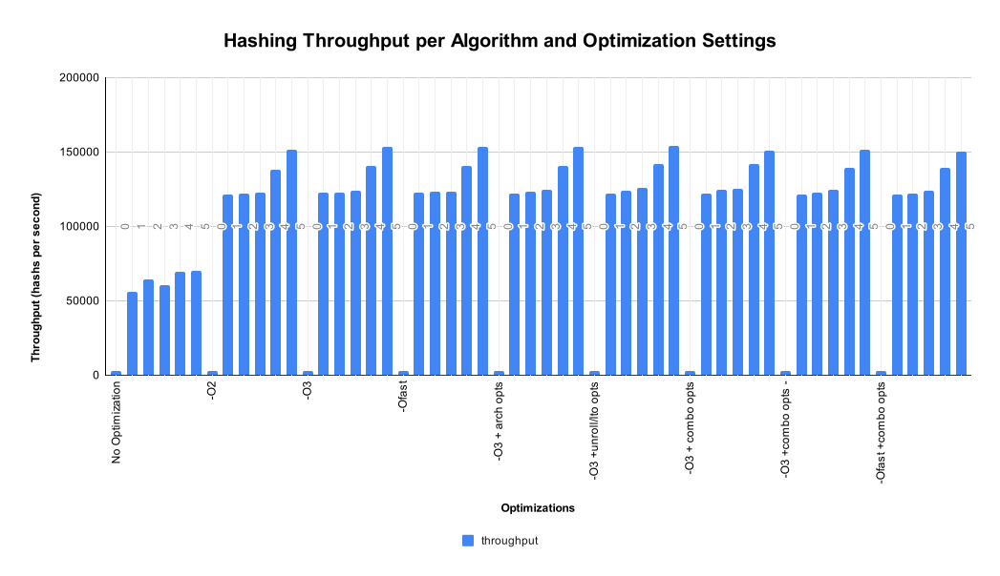

# Project-1

## Description 
This project tests five different programs supplied by the instructor that generate hash values of a large input file of blocks of data. Each uses a slightly different algorithm than the previous program. Each is to be run using the `time` utility to gather execution times and memory utilization, then throughput and performance ratios (relative to the base algorithm) are computed for each. The performance ratio is calculated only within the context of the current algorithm (e.g. `hash-02` at optimization `-O2` is ratioed (is that a word?) with `hash-00` at optimization `-O2` only).

### Measurements
For each program and variant, I ran the programs 10 times, gathered the timing data, and averaged them across the 10 runs.  This is intended to filter out some of the variations in runtime due to things such as momentary system loads and interrupt timing. 

*The exception to this is `hash-00` which runs for 20-50+ times longer than the others making filtering both impractical within the timeframe and, more importantly, meaningless due to the variations in runtime being statistically irrelevant at those execution times.*

#### Potential for Errors in Measurements
There remain a few possible ways in which inconsistent results may be generated, including:
- Instances of sustained server load (slowing execution across more than 10 runs)
- Execution time variations due to running under repetitive contexts
    - Slower warm-up for the first of the 10 run set (mmap, libs, etc)
    - Subsequent variants benefiting from prior setup, etc). 
In particular, the memory-mapped file, once loaded as a shared resource, may allow later executions to avoid that setup time. Depending on the eviction timing of the mapped file by the kernel (which is also complicated by the fact that other students may be testing using the same data file).

### Additional Program Variant
In addition to the 5 variants supplied, I have tested a sixth (hash-05.cpp). This variant was an AI attempt at improving upon the performance of the original set. It was generated by ChatGPT using its *o3-mini-high* model with the prompt ``How can I improve the performance of the following code:`

Output from hash-05.cpp was validated against the output from the original variants for accuracy.

#### Abandoned Test
I began testing using `-fprofile-generate` / `-fprofile-use`, but the initial testing showed no improvements and the additional overhead of running these tests didn't seem justifiable.

## Procedure (Edited from Assignment Instructions)
Use the make command to build the programs.  Note that these versions of the program are compiled with no optimization and with debug symbols.  For each compiled program, time its execution using the time command

Recall we used slightly better formatted version of the time command `> /usr/bin/time -f "%e real\t%U user\t%S sys\t%M memory (KB)"` to give better formatted output.

Record the times as we'll use them in the report.

Remove the old hash executables (the command make rmtargets will do this for you).  You can rebuild the executables and turn on optimization by issuing the command make `OPT="-O2"` (including the quotation marks.  You can also add other compiler options by inserting them inside of the quotations marks separating the options by spaces.  E.g., `OPT="-O2 -funroll-loops"`)

### Compiler Optimization Options Used

|           options        | description                          |
|--------------------------|--------------------------------------|
|(none)|No optimization options|
|-O2|Level 2 optimization|
|-O3|Level 3 optimization|
|-Ofast|Level 3 optimization, plus additional optimization that may not be standards-compliant|
|-O3 -march=native -mtune=native|Level 3 optimization, use native architecture and tuning optimization|
|-O3 -funroll-loops -fomit-frame-pointer -flto|Make loops inline, free register for use, link time optimizations|
|-O3 -march=native -mtune=native -funroll-loops -fomit-frame-pointer -flto|Combine the last two option sets|
|-O3 -march=native -mtune=native -funroll-loops -fomit-frame-pointer -flto -DNDEBUG|Same as previous, but remove runtime assertions|
|-Ofast -march=native -mtune=native -funroll-loops -fomit-frame-pointer -flto -DNDEBUG|Same as previous, but with -Ofast optimization|

## Results

| program name | optimization level | real (wall‑clock) time | user time | system time | memory usage | throughput | performance improvement over base program |
|--------------|--------------------|------------------------|-----------|-------------|--------------|------------|------------------------------------------|
|hash-00||346.90|340.05|4.73|2880|2883|1.00|
|hash-01||17.78|16.39|1.24|3008|56237|19.51|
|hash-02||15.63|14.20|1.27|3237|63996|22.20|
|hash-03||16.49|15.06|1.25|2891|60643|21.04|
|hash-04||14.38|13.76|0.46|5010465|69546|24.13|
|hash-05||14.33|13.71|0.47|5027226|69793|24.21|
|hash-00|-O2|336.60|330.82|3.83|2880|2971|1.00|
|hash-01|-O2|8.22|6.88|1.24|3062|121640|40.94|
|hash-02|-O2|8.19|6.82|1.27|3118|122160|41.12|
|hash-03|-O2|8.15|6.77|1.26|3009|122775|41.33|
|hash-04|-O2|7.25|6.65|0.46|5011098|137969|46.44|
|hash-05|-O2|6.60|6.02|0.45|5027394|151607|51.03|
|hash-00|-O3|336.72|330.57|4.37|3456|2970|1.00|
|hash-01|-O3|8.17|6.88|1.22|3065|122414|41.22|
|hash-02|-O3|8.14|6.79|1.28|3183|122926|41.39|
|hash-03|-O3|8.05|6.76|1.22|3180|124224|41.83|
|hash-04|-O3|7.11|6.59|0.46|5012361|140607|47.35|
|hash-05|-O3|6.52|6.01|0.45|5027568|153327|51.63|
|hash-00|-Ofast|336.65|330.41|4.48|2880|2970|1.00|
|hash-01|-Ofast|8.13|6.88|1.17|3064|122956|41.39|
|hash-02|-Ofast|8.10|6.79|1.25|3123|123411|41.55|
|hash-03|-Ofast|8.10|6.77|1.25|2948|123426|41.55|
|hash-04|-Ofast|7.12|6.59|0.45|5012189|140371|47.26|
|hash-05|-Ofast|6.52|6.01|0.45|5027686|153468|51.67|
|hash-00|-O3 -march=native -mtune=native|337.50|331.16|4.53|2896|2963|1.00|
|hash-01|-O3 -march=native -mtune=native|8.19|6.80|1.27|3120|122100|41.21|
|hash-02|-O3 -march=native -mtune=native|8.10|6.73|1.27|3123|123426|41.66|
|hash-03|-O3 -march=native -mtune=native|8.03|6.69|1.26|3120|124517|42.02|
|hash-04|-O3 -march=native -mtune=native|7.10|6.58|0.45|5011847|140885|47.55|
|hash-05|-O3 -march=native -mtune=native|6.52|6.02|0.44|5027861|153304|51.74|
|hash-00|-O3 -funroll-loops -fomit-frame-pointer -flto|336.42|330.06|4.58|2880|2972|1.00|
|hash-01|-O3 -funroll-loops -fomit-frame-pointer -flto|8.21|6.87|1.27|3062|121773|40.97|
|hash-02|-O3 -funroll-loops -fomit-frame-pointer -flto|8.07|6.76|1.24|3122|123931|41.69|
|hash-03|-O3 -funroll-loops -fomit-frame-pointer -flto|7.93|6.66|1.19|3063|126088|42.42|
|hash-04|-O3 -funroll-loops -fomit-frame-pointer -flto|7.06|6.54|0.45|5012191|141623|47.64|
|hash-05|-O3 -funroll-loops -fomit-frame-pointer -flto|6.49|5.98|0.44|5027856|154012|51.81|
|hash-00|-O3 -march=native -mtune=native -funroll-loops -fomit-frame-pointer -flto|333.94|327.53|4.65|2896|2995|1.00|
|hash-01|-O3 -march=native -mtune=native -funroll-loops -fomit-frame-pointer -flto|8.19|6.90|1.22|3119|122115|40.78|
|hash-02|-O3 -march=native -mtune=native -funroll-loops -fomit-frame-pointer -flto|8.03|6.75|1.22|3120|124580|41.60|
|hash-03|-O3 -march=native -mtune=native -funroll-loops -fomit-frame-pointer -flto|7.98|6.66|1.26|3294|125266|41.83|
|hash-04|-O3 -march=native -mtune=native -funroll-loops -fomit-frame-pointer -flto|7.06|6.53|0.45|5012188|141723|47.33|
|hash-05|-O3 -march=native -mtune=native -funroll-loops -fomit-frame-pointer -flto|6.62|6.02|0.45|5026478|151012|50.43|
|hash-00|-O3 -march=native -mtune=native -funroll-loops -fomit-frame-pointer -flto -DNDEBUG|335.66|329.19|4.45|2880|2979|1.00|
|hash-01|-O3 -march=native -mtune=native -funroll-loops -fomit-frame-pointer -flto -DNDEBUG|8.22|6.89|1.22|3058|121625|40.82|
|hash-02|-O3 -march=native -mtune=native -funroll-loops -fomit-frame-pointer -flto -DNDEBUG|8.14|6.78|1.26|3007|122880|41.25|
|hash-03|-O3 -march=native -mtune=native -funroll-loops -fomit-frame-pointer -flto -DNDEBUG|8.04|6.69|1.21|3062|124425|41.76|
|hash-04|-O3 -march=native -mtune=native -funroll-loops -fomit-frame-pointer -flto -DNDEBUG|7.19|6.58|0.44|5010460|139005|46.66|
|hash-05|-O3 -march=native -mtune=native -funroll-loops -fomit-frame-pointer -flto -DNDEBUG|6.61|6.02|0.46|5026934|151286|50.78|
|hash-00|-Ofast -march=native -mtune=native -funroll-loops -fomit-frame-pointer -flto -DNDEBUG|334.26|327.89|4.53|2896|2992|1.00|
|hash-01|-Ofast -march=native -mtune=native -funroll-loops -fomit-frame-pointer -flto -DNDEBUG|8.23|6.90|1.19|2943|121477|40.60|
|hash-02|-Ofast -march=native -mtune=native -funroll-loops -fomit-frame-pointer -flto -DNDEBUG|8.20|6.82|1.21|3009|121892|40.74|
|hash-03|-Ofast -march=native -mtune=native -funroll-loops -fomit-frame-pointer -flto -DNDEBUG|8.08|6.69|1.23|2948|123793|41.38|
|hash-04|-Ofast -march=native -mtune=native -funroll-loops -fomit-frame-pointer -flto -DNDEBUG|7.19|6.56|0.46|5012136|139024|46.47|
|hash-05|-Ofast -march=native -mtune=native -funroll-loops -fomit-frame-pointer -flto -DNDEBUG|6.66|6.03|0.46|5025265|150128|50.18|

### Chart of Throughput by Algorithm and Optimization Settings

### Questions Posed in Assignment

**1. What operation do you think accounts for most of hash-00's runtime?**

Converting incoming data from text to binary is the likely source of the lion's share of `hash-00`'s runtime. A little investigation measuring times using `steady_clock()` (and compensating for the execution time of `steady_clock::now()`) showed that this appears to be the case. The text-to-binary conversion does not have to be a particularly long running operation to have this impact, as it's performed over 5 billion times during hash-00's execution.

**2. hash-01 and hash-02 both dynamically allocate memory for each hash computation.  Is there much difference time-wise between their two allocation methods?**

The difference between the two allocation methods seems to be significant when no optimization is used (`hash-02`'s runtime is \~12% less than `hash-01`), but when optimizations are enabled, that difference largely disappears (\~0.4%-2%).

**3. hash-03 avoids the allocation by using a fixed-size array.  Is there an appreciable speed difference?**

Comparing `hash-03` times with `hash-01` and `hash-02` shows that this approach seems to this algorithm improves more with optimizations. Without optimization, it is faster than `hash-01`, but slower than `hash-02`. However, that changes when optimization of any sort is directed of the compiler, in which case it's slightly faster than both (\~0.5%-1.7%).

**4. Why is hash-04's memory usage so much larger than any of the other versions?  Hint: recall when we discussed how the operating system reads a file and makes it available to an application.  Specifically, the O/S will transfer data from disk to its own memory, and then copy from there into buffers provided by the application.  In the memory map case, the O/S is merely sharing the copy of the file's data that is in its (the O/S's) memory, and not making an additional copy from its memory into memory only in the application**

`hash-04` (and by extension my variant `hash-05` which is a modification of `hash-04`) utilizes `mmap` (memory mapped files) to accelerate ingestion of data from the input file.  `mmap` reserves virtual address space equivalent to the size being passed to `mmap`. As pages are accessed, they are added to `hash-04`'s virtual memory space. Even though it does not reflect new physical memory being consumed, this reserved space is included in the metrics reported by `time`.

**5. What other compiler options did you try, and did they help at all?**

I tried several different combinations of compiler options (see Compiler Optimization Options above). As well as combining some together. Ultimately, while `-O3 -funroll-loops -fomit-frame-pointer -flto` produced the best results for the fastest algorithm, the improvements were small enough that they may be more an artifact of variable execution time not fully being evened out with the "10 run averaging" methodology.  This suggests that the compiler is able to best select optimizations without additional guidance from the developer, within the context of the architecture and tools used.
