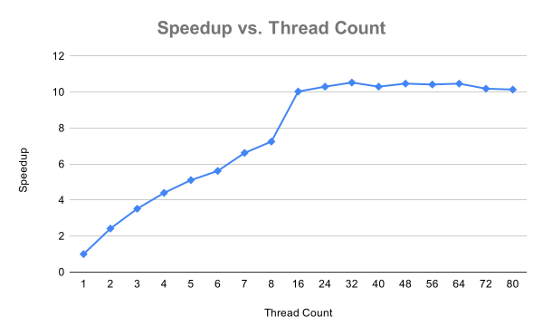

# Project 2

## Description
This project explores increasing performance by increasing parallelism of execution. In this case, using threading.  The hashing algorithm `hash-04` from Project 1 is parallelized to different degrees (i.e. the number of simultaneous threads are varied) to see how far threading can be productively taken. 

## Process
Similar to Project 1, the hashing program is run using the `time` utility to collect runtime information. Unlike Project 1, a thread count is specified over which the hashing load is distributed. `hash04` is executed multiple times, with the number of threads being increased for each run. This allows us to see at what point the performance benefit drops off and/or regresses.

## Results

### Raw Timing Data

|Thread Count|Wall Clock Time|User Time|System Time|Speedup|
|:--:|--:|--:|--:|:--:|
|1|19.06|13.99| 2.15|1.00|
|2| 7.88|14.65| 0.50| 2.42|
|3| 5.41|14.75| 0.56| 3.52|
|4| 4.33|14.98| 0.73| 4.40|
|5| 3.73|15.89| 0.85| 5.11|
|6| 3.39|15.74| 1.01| 5.62|
|7| 2.88|16.04| 0.99| 6.62|
|8| 2.63|16.08| 1.19| 7.25|
|16| 1.90|17.58| 2.88|10.03|
|24| 1.85|18.28| 7.10|10.30|
|32| 1.81|18.00|14.57|10.53|
|40| 1.85|17.55|21.49|10.30|
|48| 1.82|17.38|30.51|10.47|
|56| 1.83|17.18|37.66|10.42|
|64| 1.82|16.81|36.61|10.47|
|72| 1.87|16.92|37.58|10.19|
|80| 1.88|16.98|34.50|10.14|

### Speed-Up vs Thread Count

### Evaluation

#### Question: Why you think more threads aren’t necessary better?

The system used to run these tests has a CPU with 18 cores.  As the number of threads approaches that number, there becomes more competition for access to those cores, and as it reaches that number, the CPU is not able to process more threads concurrently, resulting in threads having to wait their turn.  In the aggregate, the program still gets roughly the same amount compute resources, so the total runtime doesn't vary considerably from one case to the next.
  
## Exploring Amdahl's Law

Amdahl's Law suggest that the formula for representing the serial vs parallel time a program runs is represented by the equation:

$T = sT + pT$ 

Which further factors to:

$T = (1 - p)T + pT$

And when we add N thread to the equation we get:

$T = (1 - p)T + \frac{p}{n}T$

Or:

$\textrm{speed-up factor} = \frac{1}{(1 - p) + \frac{p}{n}}$

### Question: Do you think it’s possible to get “perfect scaling” — meaning that the (1-p) terms is zero?

Not likely. Virtually all algorithms and problems to be solved involve a mix of operations, some of which will be parallelizable and some which won't.  In addition, there will always be setup, teardown, and, more importantly, handling of the resulting data, which will often be less parallelizable than the computations needed to generate the solution.  In the context of the algorithm at hand, setup includes opening and mapping the input time into memory.  There is also the synchronization enforced by the `barrier` (i.e. `arrive_and_wait()`).  And on top of all that, like a big ole juicy meatball on top of a delicious plate of shaghetti, is the limitations of reducing the size of the threads' tasks below the level of an "atomic" parallelizable operation. In this case, that would probably be the computation of a single hash.

