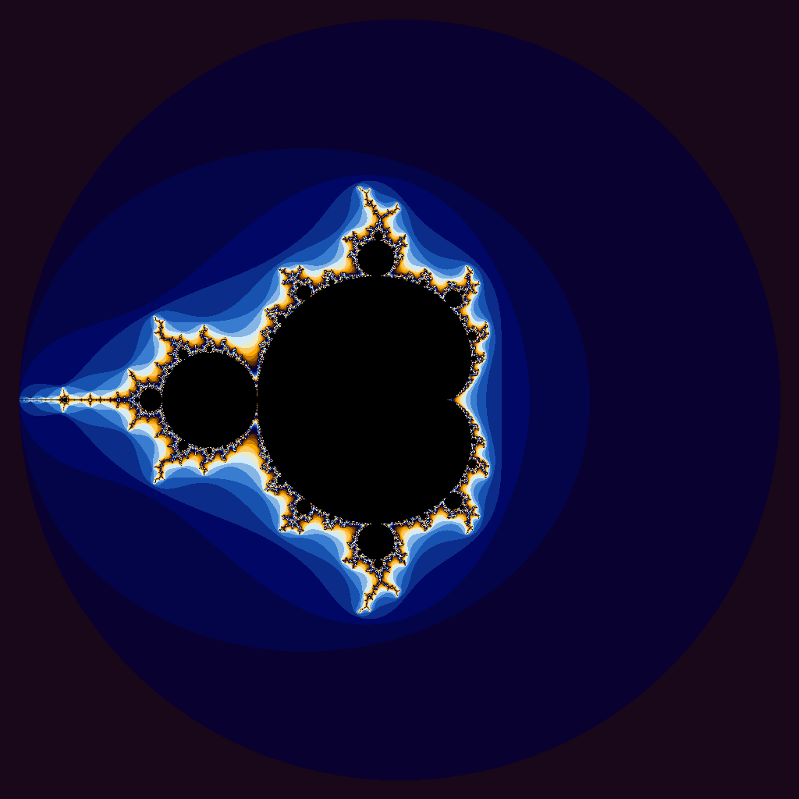
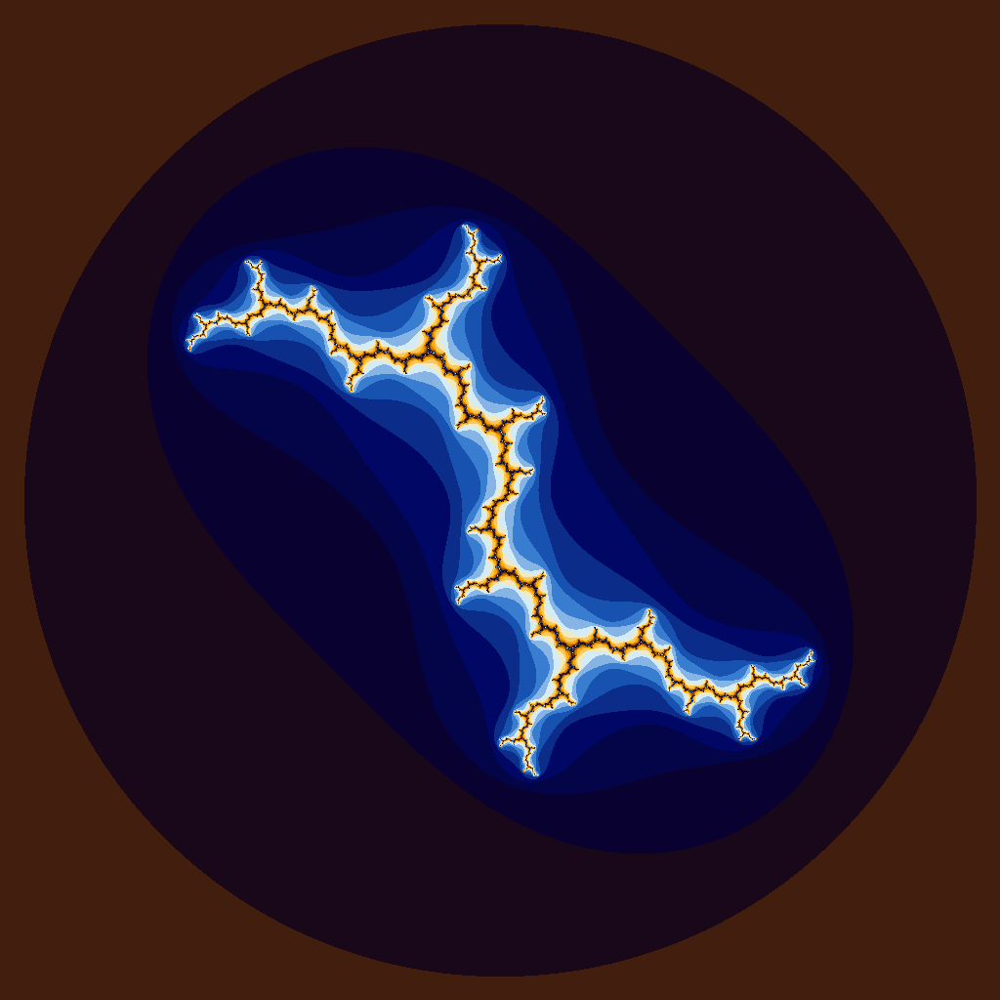
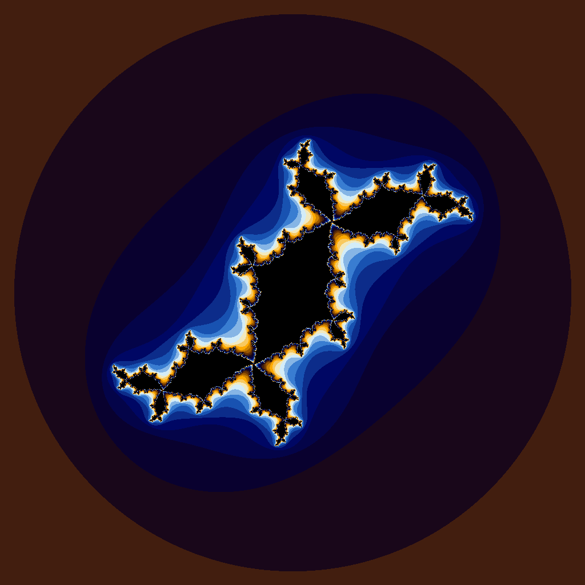
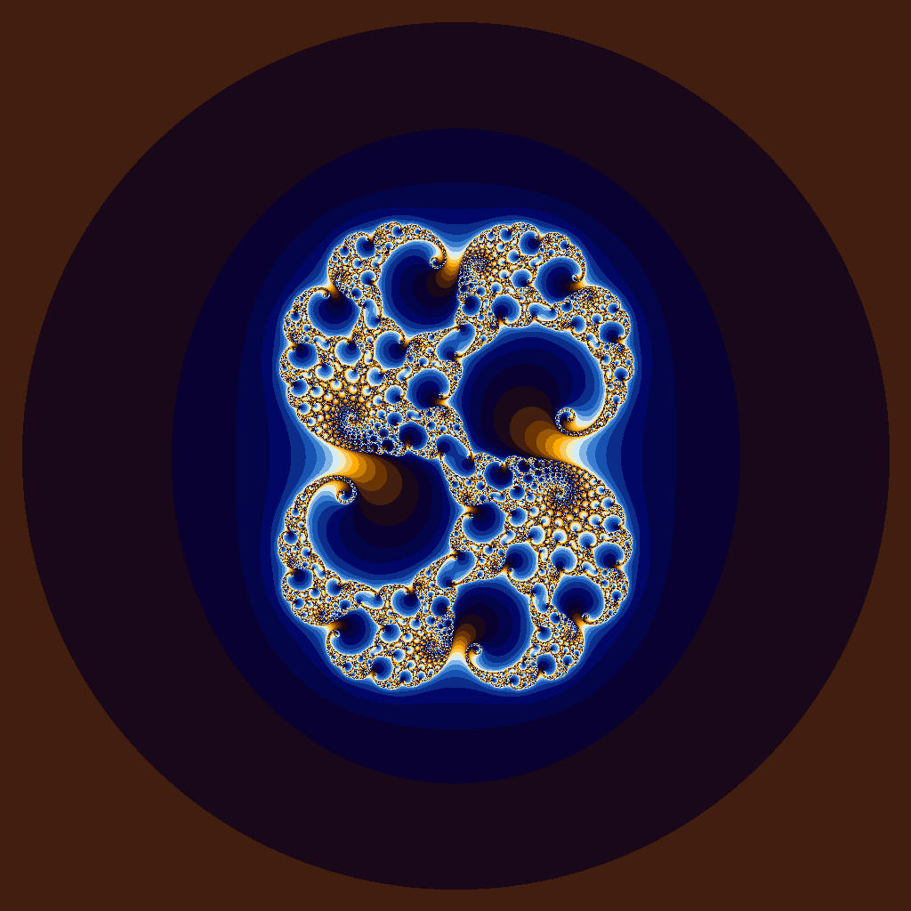
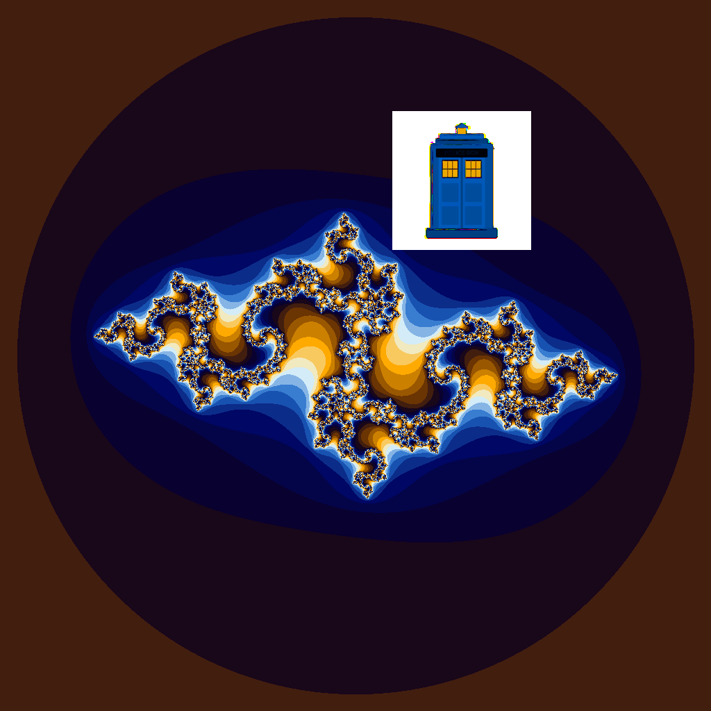

# Project 4

This project explores the power (and limitations) or parallelization using a GPU. The first example (iota) appears to be ideal for this, but, as we'll see, as implemented, it does not perform as well as the CPU based version.  The second example is generating Julia sets.

## Iota

Iota takes an array fills is with an incrementally increasing value (e.g. { 0, 1, 2, 3, 4 }. It is ripe for parallelization because the value of each position of the array can be computed without having the value of the other elements.

### CPU

|Vector<br>Length|Wall Clock<br>Time|User Time|System Time|
|:--:|--:|--:|--:|
|10| 0.00| 0.00| 0.00|
|100| 0.00| 0.00| 0.00|
|1000| 0.00| 0.00| 0.00|
|10000| 0.00| 0.00| 0.00|
|100000| 0.00| 0.00| 0.00|
|1000000| 0.00| 0.00| 0.00|
|5000000| 0.02| 0.00| 0.02|
|100000000| 0.53| 0.08| 0.44|
|500000000| 2.71| 0.42| 2.28|
|1000000000| 5.60| 0.85| 4.74|
|5000000000|33.80| 5.34|28.46|

### GPU

|Vector<br>Length|Wall Clock<br>Time|User Time|System Time|
|:--:|--:|--:|--:|
|10| 0.28| 0.00| 0.27|
|100| 0.21| 0.01| 0.20|
|1000| 0.22| 0.00| 0.21|
|10000| 0.22| 0.01| 0.21|
|100000| 0.21| 0.01| 0.19|
|1000000| 0.22| 0.01| 0.21|
|5000000| 0.24| 0.02| 0.21|
|100000000| 0.89| 0.18| 0.70|
|500000000| 3.14| 0.67| 2.46|
|1000000000| 6.03| 1.30| 4.72|
|5000000000|54.27|10.06|44.21|

### Speculation on Relative Runtimes

In the case of the iota algorithm, the GPU code runs dramatically slower than the CPU-based code. This appears to be related to process of copying data from GPU to CPU memory. This requires moving a large amount of data across a relatively slow database (as compared to accessing memory locally).


## Parallelizing Julia Set Computations

This exercise shows the true potential of CUDA kernes. You can see the performance difference between executing on CPU vs GPU.

### Performance Comparison

From the timings show below, the performance improvement of the CUDA code running on a GPU far outstrips the performance of the GPU-based code, at a 6.4:1 ratio.  Pretty impressive.

```
jjezl@vm0e5f23c954f89:~/CS-351-Computer-Architecture/Project-4$ time ./julia.cpu

real    0m1.908s
user    0m1.898s
sys     0m0.009s
jjezl@vm0e5f23c954f89:~/CS-351-Computer-Architecture/Project-4$ time ./julia.gpu

real    0m0.298s
user    0m0.012s
sys     0m0.285s
```


### The Mandelbrot Set

This is the famous Mandelbrot set. It is calculated a bit differently than the Julia sets, but it was the beginning of this whole thing, so it must be important. Right???




### Julia Sets

Here are a variety of named Julia sets.  The last few are definitely official and totally not entirely 100% made up by me. Nope. Definitely not.

#### Dendrite (0.0, -1.0i)



#### Dragon (0.36, 0.1i)

Clearly an eastern dragon. Ain't no Tiamat here...


#### Rabbit (-0.1, 0.8i)

Really? Someone needs to spend more time in nature if they think this is a rabbit...



#### Eldrich Horror Arriving at Gate 1 (0.28, 0.008i)

AAAAAAAHHHHHH!!!!!



#### Tear in the Fabric of the Space Time Continuum (-0.835, -0.2321i)


#### Rescue...

Whew! That was close...



